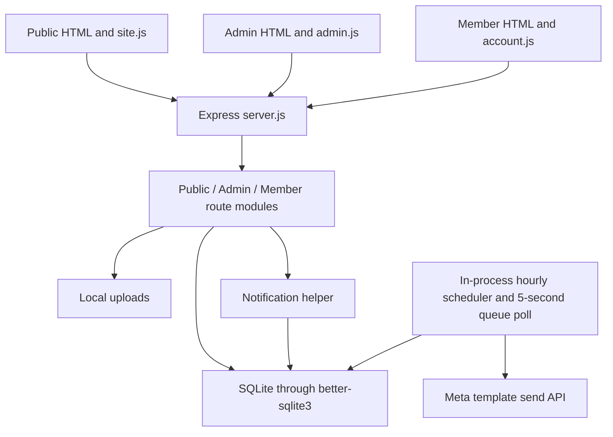
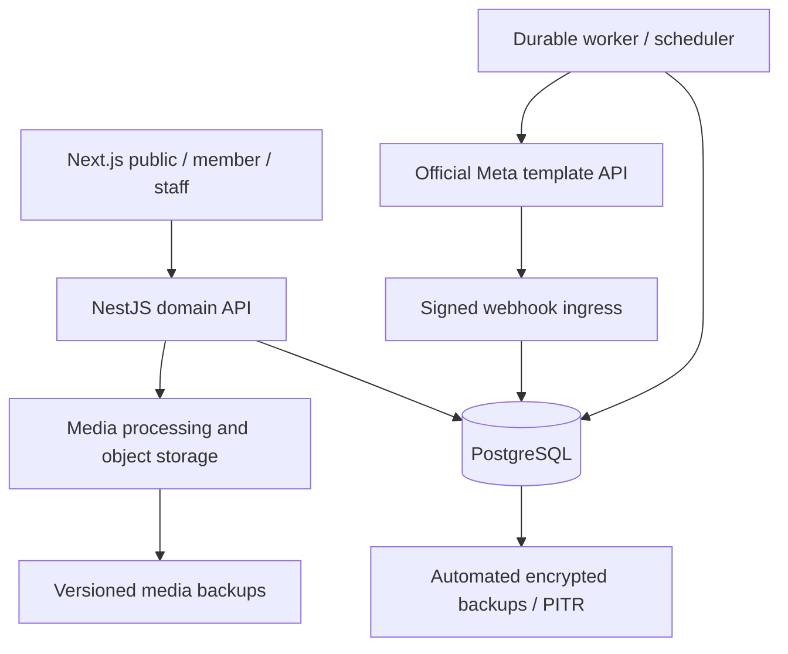

# Fight Club: codebase audit and rebuild blueprint

Audit date: 7 October 2026. Source: `abdulazizalshawa1236-ai/fightclub`, branch `main`, commit `c37ac11f36cb701c2c22efd85beb9b667371bc70`. This is an audit and proposed rebuild, not authorization to deploy a new product.

## Assessment

**Production foundation: 3/10. Prototype: 6/10.** These are judgment scores, not an industry benchmark. Feature breadth is the strongest part. Correctness under retries, identity changes, provider failures and recovery is the weakest part.

The repository captures much of the intended club journey and has useful safeguards. It does not establish a reliable operational system. A framework swap alone would reproduce its defects. The rebuild needs an explicit membership model, secure identity lifecycle, transactional writes, durable communications and tested recovery.

| Area                 | Assessment | Reason                                                                                                                              |
| -------------------- | ---------- | ----------------------------------------------------------------------------------------------------------------------------------- |
| Product coverage     | 6/10       | Public, staff and member surfaces exist; several required workflows are incomplete                                                  |
| Maintainability      | 4/10       | Small enough to understand, but routes mix validation, business rules, SQL and side effects; screens are large imperative renderers |
| Business correctness | 3/10       | Mutable memberships, repeatable renewal mutations, inconsistent reminder policy                                                     |
| Security             | 3/10       | Good primitives, but reproduced identity-change and session-revocation defects                                                      |
| Operations           | 3/10       | Persistent-volume configuration and a backup script exist; automated recovery and delivery observability do not                     |
| Verification         | 1/10       | No repository test, lint, typecheck or CI workflow found; audit probes are separate evidence                                        |

Do not infer that the site is currently deployed or that live users have encountered these failures. No production URL, production database or Meta credentials were supplied. The supplied database contains no members.

## Product and vision

Fight Club is a club sales experience coupled to a staff-controlled membership system. Its promise is straightforward: discover a suitable sport and schedule, request a package through WhatsApp, let staff confirm availability and payment, and then receive secure access to the official membership record.

The brand material describes a Riyadh club founded in 2016, training children and adults from first experience through competition. The mission emphasizes discipline, respect, safety and progress. These statements are present in the club material, not independently verified current facts.

The public experience should make first contact easy and credible. The staff experience should reduce mistakes in membership dates, package assignment, scheduling and communications. The member experience should answer: what do I have, when does it expire, what classes can I attend, and how do I renew?

Terms used in this plan:

- **Member:** a person with a unique National ID/Iqama identity record. A phone is a contact and verification channel, not a unique person identifier.
- **Membership:** a dated training contract with purchased package terms and selected sports. A person may accumulate membership history.
- **Plan:** an editable catalogue offering. Changing it must not rewrite purchased terms.
- **Enrollment request:** a WhatsApp conversation starter. It does not reserve a place, record payment or create an official membership.
- **Message delivery:** a provider receipt. An accepted API submission alone does not prove delivery.

### Journeys and launch scope

| Surface    | First-release behavior                                                                                                                                                                                     | Boundary                                                                 |
| ---------- | ---------------------------------------------------------------------------------------------------------------------------------------------------------------------------------------------------------- | ------------------------------------------------------------------------ |
| Public     | Home, About, sports/programs, nine plan variants, offers, monthly schedule/day detail, coaches, corporate programs, FAQ, contact, Arabic/English                                                           | Staff confirm availability and payment; no automatic membership creation |
| Admin      | Login, operational overview, members/search/filter/export, assignment/renewal/suspension, pricing, offers, schedule, bilingual CMS/media, announcements, consent and delivery visibility, account settings | Backend owns validation, access checks and lifecycle rules               |
| Member     | ID/Iqama + registered phone + WhatsApp OTP, own membership/status/dates/sports, relevant upcoming classes, announcements, renewal request, language/preferences                                            | Phone possession must be verified; never expose another member's record  |
| Operations | HTTPS, durable database/media, automated backups, restore drill, monitored worker and signed delivery webhooks                                                                                             | Handover requires real provider and recovery evidence                    |

All of the requested baseline belongs in launch scope. Basic audit history is recommended for launch even though the blueprint places it in a future version: the renewal and consent model needs traceability from the first real transaction.

Later releases: multiple staff roles, attendance/QR/reception check-in, invoices/payment tracking, photos/digital cards, freeze, family memberships, trainer availability, capacity/waitlists, detailed analytics, payments, mobile app/push, referrals, lead CRM, branches and chatbot/recommendations. Design extension points where needed, but do not build these during the first release.

### Existing commercial content

The seeded catalogue uses the following values. They are source content to confirm with the club, not verified current prices.

| Package    |  3 months |  6 months |     1 year |
| ---------- | --------: | --------: | ---------: |
| One sport  | SAR 2,199 | SAR 3,710 |  SAR 5,999 |
| Two sports | SAR 3,450 | SAR 5,790 |  SAR 8,999 |
| VIP        | SAR 4,900 | SAR 7,900 | SAR 12,999 |

VIP content lists all classes and two personal training sessions monthly. The implementation stores 90/180/365 days, despite displaying months/year. Resolve calendar-month versus fixed-day semantics before selling the rebuilt plans. Preserve existing recorded end dates during migration.

The source advertises Boxing, Muay Thai, Taekwondo, Jiu-Jitsu and Wrestling. Later seed content also advertises MMA and Strength & Fitness. The generated timetable contains Boxing, Muay Thai and Taekwondo. Confirm actual availability before publishing the other programs or inventing their class schedules.

## Assets retrieved and reusable material

All 194 tracked files at the audited commit were cloned into `source-audit/`. They total 20,693,632 bytes, excluding Git history and installed dependencies. The manifest records SHA-256 hashes. There are 66 tracked media occurrences representing 28 distinct file hashes, including historical duplicates. The current website uses 15 asset files.

| Asset group          | Retrieved material                                                                     | Rebuild action                                                                                          |
| -------------------- | -------------------------------------------------------------------------------------- | ------------------------------------------------------------------------------------------------------- |
| Brand                | `logo-main.jpg`, `logo-inner.png`, `logo-interior.png`, red streak texture             | Preserve the identity; request a vector master if one exists; simplify decorative motion                |
| Share/browser icons  | OG image, favicon variants, Apple touch icon                                           | Retain originals; generate responsive/share variants from approved brand artwork                        |
| Coaches              | Seven JPEG portraits                                                                   | Use as references; request larger approved originals before large portrait layouts                      |
| Original reference   | Ten-page `Fitness Gym (Poster).pdf`                                                    | Retain as provenance for club story/programs/coaches/corporate content                                  |
| Original reference   | Standalone trainer profile JPEG                                                        | Retain privately as reference; confirm permission before republishing individual contact details        |
| Working references   | Ten PDF page renders, extracted text, trainer contact sheet                            | Useful for review; do not treat extraction text as approved translations                                |
| Historical artifacts | October 1 ZIP, release tree, publish tree, Netlify preview tree, pre-release JS/CSS/DB | Preserve for audit, exclude from new app/deployment; current root source is the implementation baseline |

Current coach filenames: `firas-saadah`, `jose-maria-tomy`, `abdullah-jawish`, `soufiane-zridy`, `roua-salim`, `adel-bek`, `abdelkarim-zridy`.

Portrait dimensions range from 127×182 to 227×209. Several are crops from a brochure, with inconsistent framing and quality. The website has no tracked training video or substantial facility photography. A premium visual rebuild needs approved club/facility/training photos or a deliberately typography-led direction. Do not substitute stock imagery as if it depicts this club.

The retrieved materials include championship and coaching claims. Keep their provenance, ask the club to confirm wording, transliteration, current staff and usage rights. The brochure and source disagree in places on names/transliterations. Do not silently resolve those differences by guessing.

The source references Google Fonts (Bebas Neue, Inter, Lalezar, Tajawal). They are remote font dependencies, not tracked font files. Select approved fonts and obtain licensed self-hosted font files during the design slice. Instagram links and map/contact links are destinations, not a license to scrape an additional photo library.

Not available from this pull: actual production `data/club.db`, `data/uploads/`, hosting/domain configuration, Meta account media/templates/approval, or independent price/schedule originals mentioned in README. GitHub's releases API returned an empty list, so there were no release attachments to fetch. The tracked release ZIP has 43 entries and predates the current coach additions. No Git LFS pointer or submodule declaration was found in the tracked tree.

Asset copies for convenient reuse are in `audit/assets/website`, `audit/assets/originals`, and `audit/assets/brochure-review`. Do not copy the whole audit directory into a public deployment.

## Current architecture and data flow



- Runtime: CommonJS JavaScript, Node >=22, Express 5, better-sqlite3, bcryptjs, jsonwebtoken, Helmet, cookie-parser, express-rate-limit and Multer.
- Public rendering: HTML shell with title/description substitution; fetch `/api/site`; imperative DOM renderers for section types; shared calendar/locale helpers. Page body is JavaScript dependent. No separate locale URL, sitemap or server-rendered content body was found.
- Admin: one Arabic-only interface in a 573-line renderer. Bilingual content fields are editable, but the staff chrome is forcibly Arabic.
- Member: 192-line renderer. Cookie session, membership summary, announcements and the same general calendar used publicly.
- Backend: route handlers validate input, execute SQL, mutate domain state and trigger communications directly. `db.js` initializes schemas, adds columns, seeds content and applies startup migrations in the same module.
- Database: `admins`, `settings`, `sections`, `plans`, `offers`, `members`, `classes`, `notifications`, `app_migrations`, `member_auth_codes`, `wa_outbox`. Foreign keys and WAL are enabled.
- Storage: local `DATA_DIR` holds DB, uploads and generated JWT secret. Docker Compose maps a persistent volume; a reverse proxy and HTTPS are deployment instructions, not provisioned infrastructure.
- Jobs: hourly notification scans and five-second outbox polling inside the HTTP server process. No independent durable scheduler or receipt webhook.

Key current API groups:

| Caller           | Routes and purpose                                                                                                                          |
| ---------------- | ------------------------------------------------------------------------------------------------------------------------------------------- |
| Public website   | `GET /api/site`, `GET /api/schedule?month=YYYY-MM`                                                                                          |
| Member login     | `POST /api/member/login`, `POST /api/member/login/verify`, logout                                                                           |
| Member dashboard | `GET /api/member/me`, `POST /api/member/notifications/read`                                                                                 |
| Admin            | Login/me/password, members CRUD/renew/CSV, stats, plans/offers, sections/reorder, classes/copy-month, notify/notifications, settings/upload |
| Infrastructure   | `GET /api/health`                                                                                                                           |

Existing safeguards worth preserving conceptually: unique National ID, parameterized queries, bcrypt password hashes, random OTPs stored hashed with expiry/attempt cap, timing-safe OTP comparison, member ID derived from session, category-specific opt-ins, HTTP-only cookies, Helmet/CSP, API no-store, SQLite backup API and persistent-volume configuration.

SQLite and plain JavaScript are not inherently the problem. The defects are in domain modeling and lifecycle handling. This app could be hardened on its existing stack; the proposed replacement offers stronger conventions and a cleaner long-term foundation.

## Findings with evidence

Source paths below refer to the untouched tracked files in `source-audit/`. Severity describes impact if deployed with real records; it does not assert a production incident.

| ID  | Priority | Finding                                                                                               | Evidence                                                                             | Verification                                                                      |
| --- | -------- | ----------------------------------------------------------------------------------------------------- | ------------------------------------------------------------------------------------ | --------------------------------------------------------------------------------- |
| F01 | P1       | Old-phone OTP verifies a replacement phone                                                            | `src/db.js:90-98`; `src/routes/admin.js:104-114`; `src/routes/member.js:83-94`       | Reproduced locally with a synthetic challenge, no Meta send                       |
| F02 | P1       | Retried renewal extends again; membership write and communications are not atomic                     | `src/routes/admin.js:124-140`                                                        | Two identical requests changed end date from April 4 to July 3, 2027              |
| F03 | P1       | Admin password change leaves existing session usable                                                  | `src/auth.js:28-42`; `src/routes/admin.js:34-40`                                     | Reproduced locally                                                                |
| F04 | P1       | API acceptance labeled sent; no delivered/read/failed receipt processing                              | `src/whatsapp.js:89-104`; `server.js:45-53`                                          | Static trace; real delivery blocked by missing Meta setup                         |
| F05 | P1       | Crash/timeout/restart can duplicate remote sends; startup requeues every sending row                  | `src/whatsapp.js:100-124`                                                            | Static concurrency/failure analysis                                               |
| F06 | P1       | Queued recipients/phones/consents can become stale while a batch awaits Meta                          | `src/whatsapp.js:83-103`                                                             | Static interleaving analysis                                                      |
| F07 | P1       | Tracked source DB includes an Admin password hash                                                     | `work/pre-release-2026-10-06/club.db`                                                | Aggregate-only inspection: one Admin, zero members; no credential value disclosed |
| F08 | P1       | Backup is manual/local, without restore automation or offsite protection                              | `scripts/backup.js:7-16`; `compose.yaml:18-19`                                       | Local synthetic backup succeeds; production recovery not verified                 |
| F09 | P1       | Person and purchased membership share one mutable row; terms depend on editable/deletable catalogue   | `src/db.js:55-66`; `src/routes/admin.js:133`; `src/routes/member.js:31-35`           | Static schema/caller review                                                       |
| F10 | P2       | Login overwrites preferences; no authenticated preference editor/history                              | `src/routes/member.js:80-90,98-117`; `public/js/account.js:35-37`                    | Static flow review                                                                |
| F11 | P2       | Upcoming memberships may get expiry warning; zero-day threshold becomes three                         | `src/notify.js:9,16-17`; `src/routes/admin.js:43`; `src/routes/member.js:30`         | Zero expression checked; date/status mismatch traced                              |
| F12 | P2       | Plan/renewal WhatsApp messages lack required details                                                  | `public/js/site.js:160`; `public/js/account.js:110`                                  | Public URLs inspected in browser                                                  |
| F13 | P2       | Suspension blocks portal entirely; renewal reactivates; old sessions can revive on reactivation       | `src/auth.js:44-48`; `src/routes/admin.js:109-114,133`                               | Static lifecycle review                                                           |
| F14 | P2       | Schedule lacks structured sport/coach/room/age, cancellation history; copy conflates parallel classes | `src/db.js:68-77`; `src/routes/admin.js:303,312-322`                                 | Static schema/copy review                                                         |
| F15 | P2       | CMS lacks drafts/revisions; startup migration overwrites About content                                | `src/db.js:375-381`; `src/routes/admin.js:217-263`                                   | Static migration review                                                           |
| F16 | P2       | Offers lack start date and terms; Admin username change absent                                        | `src/db.js:46-54`; `src/routes/admin.js:34-41,195-200`                               | Route/schema review                                                               |
| F17 | P2       | Fresh English view retains Arabic hero/buttons and program heading; staff UI is Arabic-only           | `src/db.js:196-205`; `public/js/common.js` locale fallback; `public/js/admin.js:3-5` | Reproduced public English view in browser                                         |
| F18 | P2       | Images accepted on declared MIME; no image decoding/type verification                                 | `src/routes/admin.js:379-390`                                                        | Static upload review                                                              |
| F19 | P2       | Reminder skipped when portal notification existed before verification/consent                         | `src/notify.js:23,28`; `src/whatsapp.js:60-67`                                       | Static eligibility/dedupe trace                                                   |
| F20 | P2       | No test/lint/typecheck/CI baseline; duplicate release trees and operational material in repo          | `package.json:11-16`; tracked file manifest                                          | Repository inspection                                                             |

Additional operational risks: bootstrap can print generated passwords (`src/auth.js:68-72`), password-reset script takes a password argument, worker failures are swallowed at the polling boundary, and public site settings are returned wholesale. No live Meta token or member records were demonstrated exposed. The public settings response should become an allowlisted DTO before private settings are ever added.

P1 means fix before handling real membership/identity records. P2 means required for complete blueprint acceptance or meaningful reliability/usability. No P0 production incident is claimed.

## Proposed replacement stack

**Recommendation: Next.js + TypeScript for the three web surfaces, NestJS + TypeScript for domain APIs and workers, PostgreSQL for records and durable jobs, and S3-compatible object storage for media.** Use a modular monolith with one domain backend, not microservices.

| Component     | Choice                                                                         | Why / tradeoff                                                                                                                                             |
| ------------- | ------------------------------------------------------------------------------ | ---------------------------------------------------------------------------------------------------------------------------------------------------------- |
| Web           | Next.js App Router, strict TypeScript                                          | Public HTML can render on the server; reusable typed UI for the two portals. Interactive calendar/forms remain client components                           |
| Styling/forms | Tailwind, accessible component primitives, React Hook Form, next-intl          | Consistent operations screens, explicit localization and logical RTL spacing. Validate library choices at implementation time                              |
| API           | NestJS modules/controllers/services                                            | Domain ownership, typed contracts, guards and clear boundaries. More structure than the small current app, justified by membership and messaging workflows |
| Data          | Managed PostgreSQL + Prisma migrations                                         | Foreign keys, transactional writes, locking, repeatable migrations; purchased terms separate from catalogue                                                |
| Jobs          | pg-boss worker backed by PostgreSQL, with domain outbox                        | Avoid an additional Redis service at launch; retain durable claims/retries. Use explicit domain idempotency regardless of queue features                   |
| Media         | S3-compatible bucket, approved public derivative paths, CDN                    | Files survive deploys; versioning/lifecycle and safe processing independent of application disks                                                           |
| Sessions      | Revocable server sessions with opaque cookie tokens                            | Immediate revocation after credentials/phone/access changes; browser gets no identity-bearing JWT payload                                                  |
| Testing       | Domain tests, real PostgreSQL integration tests, Playwright journeys, lint/tsc | Verify the failure paths actually found during audit                                                                                                       |
| Deployment    | Containerized web/API/worker, managed DB/media, HTTPS ingress                  | Persistent state independent of deploys; worker lifecycle independent of HTTP traffic                                                                      |

NestJS may still use Express internally. This is a replacement of application architecture, frontend, typing and persistence, not a claim that a new HTTP adapter fixes security. If a fully different language is preferred, Laravel + Filament + PostgreSQL is the strongest alternative for this Admin-heavy product.

| Alternative                         | Strength                                                    | Tradeoff                                                                                                                    | Decision                                                  |
| ----------------------------------- | ----------------------------------------------------------- | --------------------------------------------------------------------------------------------------------------------------- | --------------------------------------------------------- |
| Laravel + Filament + PostgreSQL     | Proven CRUD/policies/queues and rapid staff portal delivery | PHP plus JS skills; custom brand/member UX still requires work                                                              | Valid alternative, particularly for a PHP-owning team     |
| Next.js full-stack + PostgreSQL     | Fewer application frameworks                                | Background jobs and domain boundaries still need an independent worker; easier to let business rules spread into UI actions | Viable, but explicit backend ownership is preferable here |
| Existing Express + SQLite hardening | Lowest migration effort                                     | Does not provide requested stack change; structural cleanup still substantial                                               | Useful only if rebuild budget is withdrawn                |

The recommendation is an engineering judgment based on the requested product, not a comparative benchmark. Confirm the long-term maintainer and hosting budget before locking it in. Exact package versions should be pinned after a compatibility/security check, not guessed in this plan.

Official references consulted: [Next.js server/client components](https://nextjs.org/docs/app/getting-started/server-and-client-components), [NestJS modules](https://docs.nestjs.com/modules), [PostgreSQL locking](https://www.postgresql.org/docs/current/explicit-locking.html), [pg-boss](https://github.com/timgit/pg-boss), [PostgreSQL PITR](https://www.postgresql.org/docs/current/continuous-archiving.html), [Laravel queues](https://laravel.com/framework/docs/12.x/queues), [Filament overview](https://filamentphp.com/docs/5.x/introduction/overview). Queue guarantees apply to local jobs; they do not establish exactly-once delivery to Meta.

### Target structure and boundaries

```text
apps/web           Public, member, and Admin layouts and routes
apps/api           Domain modules, HTTP contracts, webhook ingress
apps/worker        Scheduled scans, outbox delivery, cleanup
packages/contracts Generated public/admin/member API types
packages/ui        UI primitives and design tokens
packages/i18n      Arabic/English interface messages
infra              Deploy definitions and backup/restore procedures
```

Backend modules: Identity, Members, Memberships, Catalogue, Scheduling, Content, Media, Communications, Audit. Each owns its service logic and repository queries. Controllers validate/authorize and delegate. Web components consume DTOs, never database entities. Generate frontend types from OpenAPI. No `any`, duplicated status calculations or business mutations inside UI renderers.



Serve web and API behind the same HTTPS origin where practical. Route `/api` to the backend. Sessions use secure HTTP-only cookies, CSRF protection and origin checks. Public published content may be cached; member/Admin responses remain private and uncached. Publishing invalidates public content caches so staff see their approved changes promptly.

## Domain model

| Entity                           | Purpose and invariants                                                                                                                                                                   |
| -------------------------------- | ---------------------------------------------------------------------------------------------------------------------------------------------------------------------------------------- |
| Member                           | Stable ID, name, encrypted ID/Iqama, keyed normalized identity lookup, normalized phone, language, account access state/version, optional child/adult category; unique lookup constraint |
| Membership                       | Member, purchased plan version/snapshots, selected sports, inclusive start/end dates, suspension state, row version; retain prior periods                                                |
| Membership operation             | Creation/renewal/edit/suspension with actor, idempotency key, prior/new dates and terms; retries return original result                                                                  |
| Plan / Plan version              | Catalogue identity, translations, exact monetary amount/currency, duration value/unit, benefits, sport entitlement policy, visibility/featured; archive used versions                    |
| Sport / Coach / Room / Age group | Structured schedule/catalogue identities with translations; no unrelated free-text joins                                                                                                 |
| Class session                    | Riyadh date/time or stored instant plus club timezone, sport, coach, room, age group, notes, scheduled/cancelled state and version                                                       |
| Offer                            | Translated title/body/badge/terms, start/end dates, visibility and optional plan relation                                                                                                |
| Content page / revision / block  | Typed bilingual blocks with stable IDs, order, draft/published version and media references                                                                                              |
| Media asset                      | Object key, MIME/dimensions/hash, source provenance, approval/usage metadata, alt text and public/private policy                                                                         |
| Consent event                    | Member, verified phone identity/version, category, granted/revoked, capture source/time, wording version; current state derived from history                                             |
| OTP challenge / session          | Purpose, phone/account version binding, digest, expiry, attempt count, consumed state; server session revocation                                                                         |
| Announcement / recipient         | Published announcement and audience, with own-account reads; read state separate from WhatsApp status                                                                                    |
| Outbox event / attempt / receipt | Event identity, recipient/category/template/language, membership version, due time, claim/lease, provider ID, delivery receipts and errors                                               |
| Admin / audit event              | Credential/session version; actor/action/entity/reason with masked or restricted before/after data                                                                                       |

Do not introduce invoices, booking capacity, family accounts, branch tenancy or referrals as launch tables unless a current launch requirement needs them. Keep foreign keys and stable IDs suitable for later additions.

Use exact money types (decimal or integer minor units), never floating-point business arithmetic. Store membership dates as dates in the club timezone. Validate identifiers and phone formats through shared typed rules. Encrypt reversible identity data with server-held keys; use a keyed digest for lookup rather than a bare hash of the predictable ten-digit identifier. Staff-only exports require authorization, audit and careful CSV/XLSX handling.

## Critical behavior and architecture self-review

### Enrollment

Every request button uses the selected published plan name, price/currency, duration and visible prompts for name, child/adult, sports and preferred times. It opens WhatsApp and clearly says staff confirm availability/payment. Prefer prompts in the prefill at launch to avoid collecting unnecessary public identity data. If a request form is later added, require only relevant fields and explain what is sent.

No National ID goes into a public WhatsApp URL. No membership success toast appears after opening WhatsApp. Add aggregate CTA measurement only if approved; a click does not equal a lead or sale.

### Authentication and account changes

OTP challenges bind to exact normalized phone, member ID, account version and purpose. Verify with an atomic consume, expiry and attempt guard. Phone change, account disable and relevant identity correction invalidate pending challenges and revoke sessions in the same transaction.

Rate limit per IP and account/phone lookup, with shared durable counters suitable for multiple replicas. Avoid account enumeration through differing existence responses. Hash low-entropy OTPs with a server-held secret and random challenge context; never log codes. Return truthful temporary-unavailable behavior if Meta is down. Recovery is an explicit staff process, not a hidden password/OTP bypass.

Require the current password for both Admin username and password changes. Revoke prior sessions after credential changes. Keep account access restrictions separate from membership suspension so a suspended membership can be visible with a contact-club recovery action. Resolve intentional account lockout separately.

### Membership status and renewal

Use one backend policy for Admin counts, member display, queries and reminder eligibility. Precedence: suspended, upcoming, expired, expiring soon, active. Inclusive end date means end date today remains valid; remaining days display must explicitly choose whether it includes today.

For an active membership, renewal extends from its existing inclusive end, preserving purchased history. For an expired membership, a new period begins on the Riyadh current date. Calendar-month plans require a documented month-end rule, including January 31 and leap years. Do not migrate existing fixed-day contracts into months retroactively.

Inside one database transaction: lock membership, check version/idempotency, create operation/history, update current state, append audit and domain outbox event. A duplicated request returns the first result. Separate deliberate second renewal from retry using distinct operation keys.

Suspended membership renewal must not silently lift suspension. Proposed default: staff explicitly chooses reactivation as a distinct audited action. Upcoming renewal should extend the upcoming period without making it active early; flag any package change taking effect before start. Two different simultaneous renewal operations need version/conflict handling, not merely idempotency per request.

Purchased plan/sport/price terms are snapshots. An edited plan changes future sales only. Archive plans with contracts rather than deleting their meaning. If legacy paid price is unknown, record unknown; do not infer it from the current catalogue.

### Communications

Use official Meta WhatsApp Business Platform, approved category-specific templates, recorded consent and server-only tokens. Start account/template setup in the first week since approval is an external dependency.

Use separate event-specific templates for expiring, expired and renewed messages; editable wording must follow the approved-template lifecycle. Arbitrary Admin prose cannot be assumed approved merely because it is placed in a template variable. OTP consent is separate from membership-update and marketing consent.

Status stages: queued, claimed/submitting, accepted, delivered, read, failed, suppressed and unknown outcome. The UI must not label accepted as delivered. Authenticate raw webhook payload signatures, persist before processing, deduplicate events, tolerate receipts before local acceptance writes, and handle out-of-order receipts without regressions. Provider status guidance: [Meta WhatsApp Cloud API collection](https://www.postman.com/meta/whatsapp-business-platform/documentation/wlk6lh4/whatsapp-cloud-api?entity=request-13382743-ba924e99-3d98-4954-b4e3-73a519939c33).

Before each dispatch, reload current verified phone, account state, consent, language and membership version. A renewal cancels obsolete expiry events. Separate portal notifications from WhatsApp eligibility so a preexisting portal message does not block eligible outbound reminders. Do not send a historic backlog on new consent; proposed default is one currently relevant reminder only. Consent withdrawal suppresses unsent messages, but cannot retract a request already accepted by the provider.

Domain outbox events commit with the membership. Workers lease jobs, recover expired leases and bound retries. A timeout after remote acceptance is ambiguous: mark unknown and reconcile receipts/manual review rather than blindly sending repeated notices. Do not promise exactly-once remote delivery when the provider offers no end-to-end idempotency guarantee. Announcements/offers are audience campaigns with stable campaign-recipient keys, not random dedupe keys per retry.

### Schedule and content

Monthly copy has a preview: rows to create, conflicts, skipped occurrences and target dates. Identical class keys include sport/room/coach/age and source identity, not title alone. Serialize conflicting copies and make the copy operation idempotent. Keep cancellation records instead of hard delete. Detect coach/room overlaps; explicitly approved combined-room sessions require a modeled room set.

Member upcoming classes derive from selected sports/age group. Explain unavailable or unknown assignment honestly. Do not imply a booking/seat guarantee; capacity is later scope.

CMS uses curated block types with bilingual forms, media picker, preview, publish and prior revision restore. Staff should not author JSON or CSS. Missing translation blocks publication or is explicitly approved as fallback. Public SEO metadata renders in the selected locale with language URLs/canonical/alternate links. Keep private content and internal settings out of public DTOs.

Media uploads verify file bytes, decode/re-encode supported images, cap file size/dimensions and strip unwanted metadata. Publish only approved derivatives; source profile documents and member photos remain private. Content changes never happen merely because the API process starts.

### Failure, concurrency and compatibility checklist

| Situation                                       | Required result                                                                                 |
| ----------------------------------------------- | ----------------------------------------------------------------------------------------------- |
| Membership write succeeds, provider unavailable | Membership remains correct; outbox is pending/retryable and observable                          |
| Response lost after renewal                     | Retry returns original dates; one operation/audit/outbound event                                |
| Staff edits same member concurrently            | Version conflict with refresh/review, no silent lost updates                                    |
| Phone changes during OTP                        | Old challenge rejected; new number unverified; old sessions revoked                             |
| Password changes during active Admin session    | Previous session rejected                                                                       |
| Consent changes while message awaits dispatch   | Unsent work suppressed on recheck; already in-flight boundary visible                           |
| Worker dies after Meta acceptance               | Unknown outcome retained; receipts reconciled, no false delivery claim                          |
| Provider callback repeats or arrives early      | One durable receipt effect; correlate by provider ID; retain unmatched event safely             |
| Staff changes plan or archives it               | Purchased memberships retain original contract terms                                            |
| Public cache serves yesterday's offer           | Expiry enforced during rendering/query; bounded cache freshness and invalidation                |
| Deploy starts new worker while old worker runs  | Leases prevent startup-wide requeue of healthy in-flight jobs                                   |
| Old web page calls retired API during cutover   | Versioned contract or controlled refresh/relogin; never bypass authorization                    |
| Production restored from backup                 | DB, media, encryption keys and app version are compatible; reconciliation occurs before sending |

## Delivery tickets and sequencing

Sizes: XS <1 engineering day, S 1-2, M 3-5, L 6-10. Estimates are planning ranges before team/hosting/provider decisions, not commitments. Each row is a separate reviewable workstream, split into verified commits and focused PRs. Do not mix legacy fixes and new product construction in one PR.

| Ticket                                 | Priority / size | Scope and acceptance                                                                                                                                                                       | Tests / dependency                                                                                                                   |
| -------------------------------------- | --------------- | ------------------------------------------------------------------------------------------------------------------------------------------------------------------------------------------ | ------------------------------------------------------------------------------------------------------------------------------------ |
| T01 Source and data containment        | P1 / S          | Freeze audited source/hash inventory; keep DB/archive/reference files outside deployment; verify source Admin credential reuse and rotate if needed                                        | Secret/PII scan with redacted findings; independent of rebuild                                                                       |
| T02 Product rules and approved content | P1 / M          | Confirm duration semantics, suspension/upcoming renewal, child guardian access, active programs, prices/VAT presentation, official timetable, coach wording, translations and asset rights | Staff walkthrough and source-to-content mapping; precedes schema/content publish                                                     |
| T03 Platform and contract foundation   | P1 / M          | Strict TS monorepo, Nest modules, PostgreSQL migrations, generated DTOs, lint/tests/CI, health/readiness and structured redacted logs                                                      | Blank migration, rollback/recovery compatibility, CI; after stack decision                                                           |
| T04 Identity and secure sessions       | P1 / L          | Admin current-password settings; member OTP binding/revocation/rate limits; self-only access; consent capture                                                                              | Phone edit/suspension/expiry/attempt races, old-cookie rejection and enumeration checks; T03                                         |
| T05 Membership ledger and operations   | P1 / L          | Stable identity, plan versions/sports, dates/status, assignment, renewal/suspend/reactivate, operation idempotency and audit                                                               | Real PG concurrency, double requests, partial failure, month-end/leap/Riyadh boundaries; T02-T04                                     |
| T06 Catalogue, offers and CMS          | P2 / L          | Plans/pricing/benefits, scheduled offers/terms, bilingual typed blocks/coaches/media, preview/publish/restore                                                                              | Translation completeness, hide/show, asset URL safety, publish/cache invalidation; T02-T03                                           |
| T07 Schedule operations                | P2 / L          | Structured sessions, monthly calendar/day detail, cancellation, copy preview/conflicts                                                                                                     | Parallel class preservation, short months, repeated copy, coach/room overlap; T02-T03                                                |
| T08 WhatsApp delivery and reminders    | P1 / L          | Templates, domain outbox, durable worker, consent suppression, signed receipts and Admin delivery view                                                                                     | Crash/timeout, duplicate/out-of-order receipts, withdraw consent, stale renewal warning; T04-T05, real Meta setup                    |
| T09 Premium public website             | P2 / L          | Approved design, locale URLs, public pages/sections, full plan prefill, schedule/coaches/contact, visible WhatsApp/schedule actions                                                        | Mobile/desktop Arabic/English, keyboard/reduced motion, all nine CTA details, SEO body without JS; T06-T07; design can start earlier |
| T10 Staff and member journeys          | P1 / L          | Admin overview/search/pagination/export/notes, all member actions, self membership/relevant classes/renewal/preferences                                                                    | Role/ownership denial, suspended visible state, Excel-safe export, error/retry behavior; T04-T08                                     |
| T11 Reconciled import and rehearsal    | P1 / M-L        | Import authoritative SQLite/media with stable ID maps; unknown history preserved; conflict quarantine                                                                                      | Record/identity/date/consent/media reconciliation; repeatable import; T05-T07                                                        |
| T12 Operations and handover            | P1 / L          | HTTPS/secrets/deploy isolation, automated offsite backups/PITR/media versioning, monitoring and restore drill, operator guide                                                              | Restart/deploy persistence, outage recovery, alerts, real approved-template receipt; all launch tickets                              |

Suggested sequence:

1. Week 1: T01/T02, design direction, Meta onboarding, stack/hosting choice.
2. Weeks 2-3: T03/T04 and approved public design/content model.
3. Weeks 3-5: T05/T06/T07; authoritative migration mappings.
4. Weeks 5-7: T08/T09/T10; integration and browser acceptance continuously.
5. Weeks 7-9: T11/T12, real Meta tests, restore/cutover rehearsal and staff UAT.

Allow roughly 9-12 calendar weeks with two experienced engineers plus design/QA support, subject to external approvals and migration complexity. A single engineer may need approximately 14-20 weeks. These ranges include stabilization; provider approval can extend the calendar independently. Re-estimate after T02 and team assignment.

Design and content preparation can progress alongside foundations. Public previews can use approved public fixtures; private workflows must use synthetic records until their controls are verified. Production reminders cannot launch before identity, consent and membership transaction work.

## Migration, rollout and rollback

1. Determine whether a deployed system exists. The repository documents local/predeployment operation; the supplied database is authoritative for this rebuild, as confirmed by the owner.
2. Obtain an access-controlled DB snapshot through SQLite backup, uploads, content export and provider job state. Record hashes/counts; never add member records/secrets to Git.
3. Reconcile source versions. The committed snapshot contains 9 plans, 8 sections and 1,565 classes, while the fresh current app creates additional coach/corporate sections. Startup-generated classes are not proof of a staff-approved future timetable.
4. Validate unique normalized IDs and phone normalization. Shared household phones are allowed unless a confirmed business rule prohibits them. Resolve missing child IDs/guardian access explicitly before enrollment; do not fake adult identities.
5. Import people and one known legacy membership period with exact dates. Prior payments, purchases, sports and renewals cannot be reconstructed when absent. Mark unknown values for staff review, retain legacy reference IDs and archive original source securely.
6. Map plans to versions, bilingual sections to typed blocks, coaches/sports to structured IDs. Treat room-like notes as candidates for review, not automatically trusted fields.
7. Preserve recorded consent only with verified provenance; capture its historical limitations. Do not infer opt-in from a phone number, message history or active membership. Require fresh verification/consent where evidence is insufficient. Revoke legacy sessions and discard login challenges at cutover.
8. Reconcile queued communications. Disable the legacy scheduler before enabling new delivery. Do not replay old expired reminders or import `sent` as delivered. Keep ambiguous historical outcomes explicitly unknown.
9. Dry-run in staging, compare counts, unique identities, date ranges, orphan relations, media references and published content. Have staff approve sampled records and schedule/prices.
10. At cutover, stop legacy writes/jobs, take final backup/delta, import and reconcile, switch traffic, smoke test all three surfaces, then enable new delivery after checks.
11. Keep the old app/data archived and inaccessible publicly. If new writes have occurred, reverting traffic alone is unsafe. Pause writes/messages and reconcile changes before restoring any older system. A rollback must never discard renewals or resend a backlog.

Operational targets proposed for approval: daily encrypted offsite backup plus managed PostgreSQL PITR, 30-day retention, recovery point target <=15 minutes and recovery time <=4 hours. Choose a host that can meet these targets and document a measured restore drill. Media versioning/deletion retention and encryption-key recovery must be included. Proposed targets are not achieved guarantees or priced hosting commitments.

Private records and tokens use separate secrets/storage from published assets. Document approved hosting region, access owner and retention policy before selecting infrastructure. Obtain a legal/privacy review for the chosen jurisdiction and identity/minor handling if required; this audit makes no compliance certification.

## Acceptance and test strategy

| Layer                | Evidence required                                                                                                                                                                               |
| -------------------- | ----------------------------------------------------------------------------------------------------------------------------------------------------------------------------------------------- |
| Domain               | Status precedence, zero warning threshold, inclusive dates, fixed-day/calendar-month calculations, active/expired/upcoming/suspended renewals                                                   |
| Database/integration | Unique identity constraint, snapshots survive plan edits, operation transactions, concurrent changes, idempotency, receipt dedupe and worker claim recovery                                     |
| Security             | Own-account access only, OTP phone/version binding, attempt/expiry limits, session revocation, CSRF/origin checks, upload validation, no sensitive public DTOs/logs/build artifacts             |
| Browser              | Arabic/English on phone/tablet/desktop; readable mixed scripts; keyboard/focus/reduced motion; staff content editing; member creation/edit/renew/suspend/export; clear empty/error/retry states |
| WhatsApp             | Real authentication + approved renewal/expiry template delivery to consenting test recipient; correct category/language; receipts seen in Admin; no marketing send after opt-out                |
| Operations           | HTTPS, restart/redeploy persistence, backup failure alerts, independent offsite restore including media/keys, worker crash recovery, rollback rehearsal                                         |

Every new slice gets tests for its business edge cases, lint/tsc and relevant regression checks before commit. Run production-like browser tests against real backend contracts. Test doubles are acceptable for deterministic failures, but cannot close real Meta acceptance. The final club UAT must be recorded as: "Done from my side, needs Ahmed's verification." Then record actual Ahmed/staff verification separately.

Handover gate: all user-supplied readiness criteria pass, staff can complete the core tasks without developer intervention, and real Meta/backups are verified. Do not call the product delivered based solely on a build or a deployment health check.

## Audit verification performed

- PASS: full tracked repository clone; SHA-256 inventory; archive entry inventory; original reference and brochure coach-page visual inspection.
- PASS: dependency installation and native SQLite smoke check on local Node 26.3.1. This is not validation of the documented Node 22 deployment image.
- PASS: syntax checks for server, member/Admin routes and three main browser scripts.
- PASS: isolated local app; public Arabic/English navigation, rendered plan URLs/calendar, Admin login/overview/CMS list, member login validation observed in the actual browser.
- PASS: synthetic API duplicate-ID rejection; own member DTO omits National ID; missing Meta credentials produce an honest 503.
- FAIL: old-phone challenge accepted after phone replacement; duplicated renewal extends twice; old Admin session accepted after password change; zero warning period resolves to three.
- FAIL: fresh English public page retains Arabic hero/buttons and some headings. Browser screenshot saved.
- PASS: backup script created a local synthetic DB/uploads backup; it was copied to a separate restore directory and opened successfully, with integrity check `ok`, zero foreign-key errors, the synthetic member present and the uploads directory restored. No representative uploaded media file was tested. This validates the local mechanism; automated/offsite/full disaster recovery remains NOT RUN.
- NOT RUN: repository unit/integration suite, lint and typecheck, because no such scripts/configuration were found.
- BLOCKED: real WhatsApp OTP/reminder delivery and template approvals, production HTTPS/availability and real data migration, because external accounts/data were not supplied.
- NOT RUN: exhaustive member browser dashboard, all Admin editing/export flows, production Docker build, dependency vulnerability certification or full penetration test.

Runtime probe results are in `runtime-checks.json`; local backup evidence is in `backup-check.json`; screenshot evidence is under `screenshots/`. Browser interaction used the in-app browser's Playwright API. Two independent read-only review agents checked security/lifecycle and product/model gaps. Findings were reconciled with source and the stated local reproductions.

The English public screenshot demonstrates the retained Arabic hero on a fresh current database:


The staff CMS list and member login screenshots are also retained locally:


## Decisions to settle before implementation

The plan can be reviewed now without further discovery. Implementation needs a small set of owner decisions:

1. Confirm recommended TypeScript stack versus Laravel/Filament, and identify its long-term maintainer.
2. Confirm whether the club has a live app/database and the authoritative prices/timetable/content/assets.
3. Resolve calendar months versus fixed days, upcoming/suspended renewals, and child/guardian identity/access.
4. Confirm hosting budget/region and recovery objectives; provide club-owned domain/Meta access through secure configuration.
5. Approve the first-release scope and design direction. Begin with T01-T05; later product features remain separately scoped.

No existing app feature was patched and no code was pushed, published or deployed during this audit.
